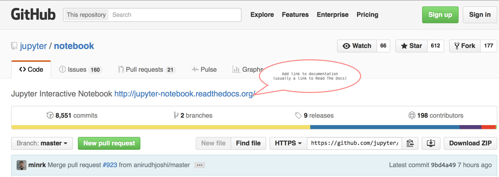

# Setting up a README

Providing users and developers consistency across repos is a valuable time
saver and improves user productivity.

On a larger scope, having the Jupyter name appear prominently in a repo's
`README.md` file improves the project's name awareness.

## Recommended elements in Jupyter project repos

### Link in repo description
Please include a link to the documentation in the repo's description.

### Badges in README
One common way that individuals find documentation is to look for and click
on the doc badge that commonly is found right after the title. Another
benefit is an easy visual indication if the docs are not rendering properly.

### Resources section in README

A *Resources* section at the end of the `README.md` gives useful links and
information to users about the individual project and the larger Project
Jupyter organization. Make sure to include any links to the individual project's
demo notebooks, if available.

The *Resources* section includes:

## Checklist adding docs to a new or existing GitHub Repo

- [ ] Add a link to documentation in repo description (requires GitHub repo privileges)
- [ ] Add badges to README (Edit `README.md` and submit pull request)
- [ ] Add resources section to README (Edit `README.md` and submit pull request)

*Dated: 1-4-2016*
*Revised: 1-7-2016*