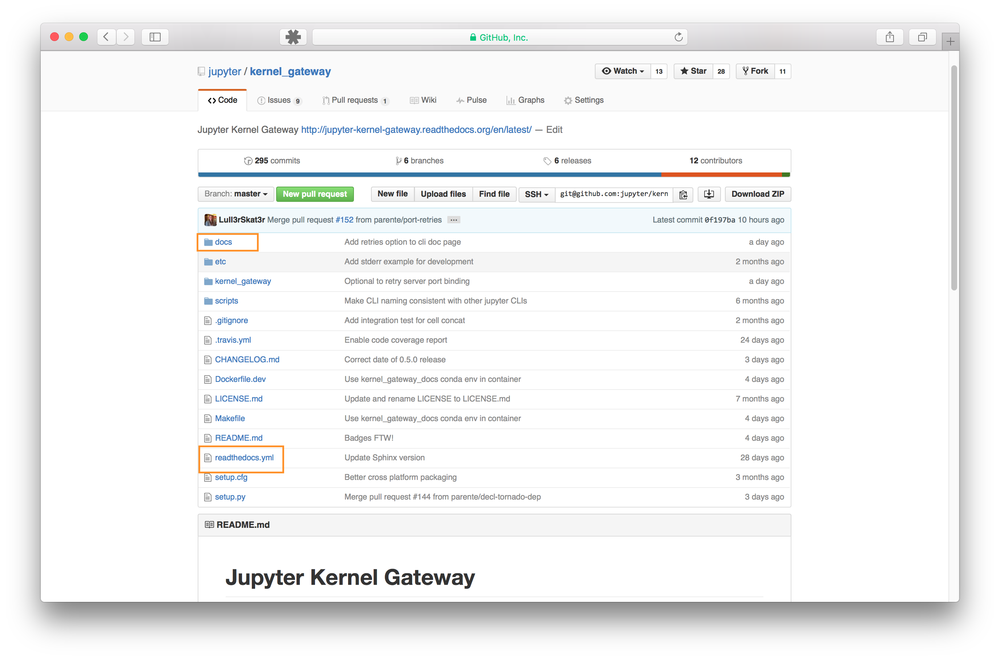

# Structuring a repo for docs

## Root level of the repo

- ``docs`` directory : All source files for documentation go here.
- ``readthedocs.yml`` : configuration file for readthedocs to build using
  conda

