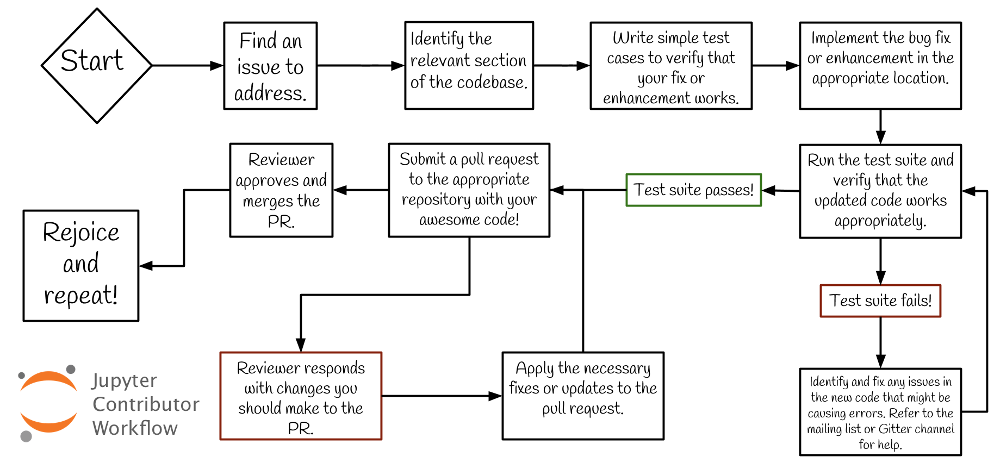

===============
How can I help?
===============

.. contents:: Contents
   :local:

Contributing to open source can be a nerve-wrecking process, but don't worry
everyone on the Jupyter team is dedicated to making sure that your open source
experience is as fun as possible. At any time during the process described
below, you can reach out to the Jupyter team on Gitter or the mailing list for
assistance. If you are nervous about asking questions in public, you can also
reach out to one of the Jupyter developers in private. You can use the public
Gitter to find someone who has the best knowledge about the code you are
working with and interact with the in a personal chat.

As you begin your open source journey, remember that it's OK if you don't
understand something, it's OK to make mistakes, and it's OK to only contribute
a small amount of the code necessary to fix the issue you are tackling. Any and
all help is welcome and any and all people are encouraged to contribute.

Submitting Pull Requests
========================

Individuals are welcome, and encouraged, to submit pull requests and contribute
to the Jupyter source. If you are a first-time contributor looking to get
involved with Jupyter, you can use the following query in a GitHub search to
find beginner-friendly issues to tackle across the Jupyter codebase. This query
is particularly useful because the Jupyter codebase is scattered across several
repositories within the jupyter organization, as opposed to a single
repository. You can click the link below to find sprint-friendly issues.

`is:issue is:open is:sprint-friendly user:jupyter
<https://github.com/search?q=is%3Aissue+is%3Aopen+is%3Asprint-friendly+user%3Ajupyter&type=Issues&ref=searchresults>`_

Once you've found an issue that you are eager to solve, you can use the guide
below to get started. If you experience any problems while working on the
issue, leave a comment on the issue page in GitHub and someone on the core team
will be able to lend you assistance.

Please keep in mind that what follows are guidelines. If you work through the
steps and have questions or run into time constraints, please submit what you
already have worked on as a pull request and ask questions on it. Your effort,
including partial or in-progress work, is appreciated.

1. Fork the repository associated with the issue you are addressing and clone
   it to a local directory on your machine.

2. ``cd`` into the directory and create a new branch using ``git checkout -b
   insert-branch-name-here``. Pick a branch name that gives some insight into
   what the issue you are fixing is. For example, if you are updating the text
   that is logged out by the program when a certain error happens you might
   name your branch `update-error-text`.

3. Refer to the repository's README and documentation for details on
   configuring your system for development.

4. Identify the module or class where the code change you will make will
   reside and leave a comment in the file describing what issue you are trying
   to address.

5. Open a pull request to the repository with ``[WIP]`` appended to the front
   so that the core team is aware that you are actively pursuing the issue.
   When creating a pull request, make sure that the title clearly and concisely
   described what your code does. For example, we might use the title "Updated
   error message on ExampleException". In the body of the pull request, make
   sure that you include the phrase "Closes #issue-number-here", where the
   issue number is the issue number of the issue that you are addressing in
   this PR.

   Feel free to open a PR as early as possible. Getting early feedback on your
   approach will save you time and prevent the need for an extensive refactor
   later.

6. Run the test suite locally in order to ensure that everything is properly
   configured on your system. Refer to the repository's README for information
   on how to run the test suite. This will typically require that you run the
   ``nosetests`` command on the commandline. Alternatively, you may submit a
   pull request. Our Continuous Integration system will test your code and
   report test results.

7. Find the test file associated with the module that you will be changing.
   In the test file, add some tests that outline what you expect the behavior
   of the change should be. If we continue with our example of updating the
   text that is logged on error, we might write test cases that check to see
   if the exception raised when you induce the error contains the appropriate
   string. When writing test cases, make sure that you test for the following
   things.

   * What is the simplest test case I can write for this issue?
   * What will happen if your code is given messy inputs?
   * What will happen if your code is given no inputs?
   * What will happen if your code is given too few inputs?
   * What will happen if your code is given too many inputs?

   If you need assistance writing test cases, you can place a comment on the
   pull request that was opened earlier and one of the core team members will
   be able to help you.

8. Go back to the file that you are updating and begin adding the code for your
   pull request.

9. Run the test suite again to see if your changes have caused any of the test
   cases to pass. If any of the test cases have failed, go back to your code
   and make the updates necessary to have them pass.

10. Once all of your test cases have passed, commit both the test cases and the
    updated module and push the updates to the branch on your forked repository.

11. Once you are ready for your pull request to be reviewed, remove the [WIP]
    tag from the front of issue, a project reviewer will review your code for
    quality. You can expect the reviewer to check for the documentation
    provided in the changes you made, how thorough the test cases you provided
    are, and how efficient your code is. Your reviewer will provide feedback on
    your code and you will have the chance to edit your code and apply fixes.

12. Once your PR is ready to become a part of the code base, it will be merged
    by a member of the core team.

Contribution Workflow
---------------------
[Link to full alt-text of Contribution Workflow flow chart.](https://gist.githubusercontent.com/MarsBarLee/2dc5e9c83adf0555d08277b2262302e5/raw/be6a0c46f58d7135a75df7747698cef676b9cdc0/Jupyter%2520Documentation:%2520Contribution%2520Workflow%2520Alt-Text)
 image for full text.

Core Developer Workflow
-----------------------

To help you understand our review process by core developers after you submit a
pull request, here's a guide that outlines the general process (specifics may
vary a bit across our repositories). Here is an example for Jupyter notebook
4.x:

In general, Pull Requests are against ``master`` unless they only affect a
backport branch. If a PR affects master and should be backported, the general
flow is:

  0. mark the PR with milestone for the next backport release (4.3)
  1. merge into master
  2. backport to 4.x
  3. push updated 4.x branch

Backports can be done in a variety of ways, but we have `a script
<https://github.com/ipython/ipython/blob/master/tools/backport_pr.py>`_ for
automating the common process to:

  1. download the patch ` e.g. <https://patch-diff.githubusercontent.com/raw/jupyter/notebook/pull/1645.patch>`
  2. checkout the 4.x branch
  3. apply the patch
  4. make a commit

which works for simple cases, at least.

In this case, it would be:

    python /path/to/ipython-repo/tools/backport_pr.py jupyter/notebook 4.x 1645

Submitting a Bug
=================

While using the Notebook, you might experience a bug that manifests itself in 
unexpected behavior.  If so, we encourage you  to open issues on GitHub. To 
make the navigating issues easier for both developers and users, we ask that
you take the following steps before submitting an issue.

1. Search through StackOverflow and existing GitHub issues to ensure that 
   the issue has not already been reported by another user. If so, provide
   your input on the existing issue if you think it would be valuable.

2. Prepare a small, self-contained snippet of code that will allow others
   to reproduce the issue that you are experiencing.

3. Prepare information about the environment that you are executing the code
   in, in order to aid in the debugging of the issue. You will need to provide
   information about the Python version, Jupyter version, operating system,
   and browser that you are using when submitting bugs. You can also use
   ``pip list`` or  ``conda list`` and ``grep`` in order to identify the
   versions of the libraries that are relevant to the issue that you are
   submitting.

4. Prepare a simple test that outlines the expected behavior of the code
   or a description of the what the expected behavior should be.

5. Prepare an explanation of why the current behavior is not desired and 
   what it should be.

Reporting a Vulnerability
=========================

If you believe you've found a security vulnerability in a Jupyter project,
please report it to `security@ipython.org <mailto:security@ipython.org>`_. If you
prefer to encrypt your security reports, you can use `this PGP public
key <https://jupyter-notebook.readthedocs.io/en/stable/_downloads/1d303a645f2505a8fd283826fafc9908/ipython_security.asc>`_.
