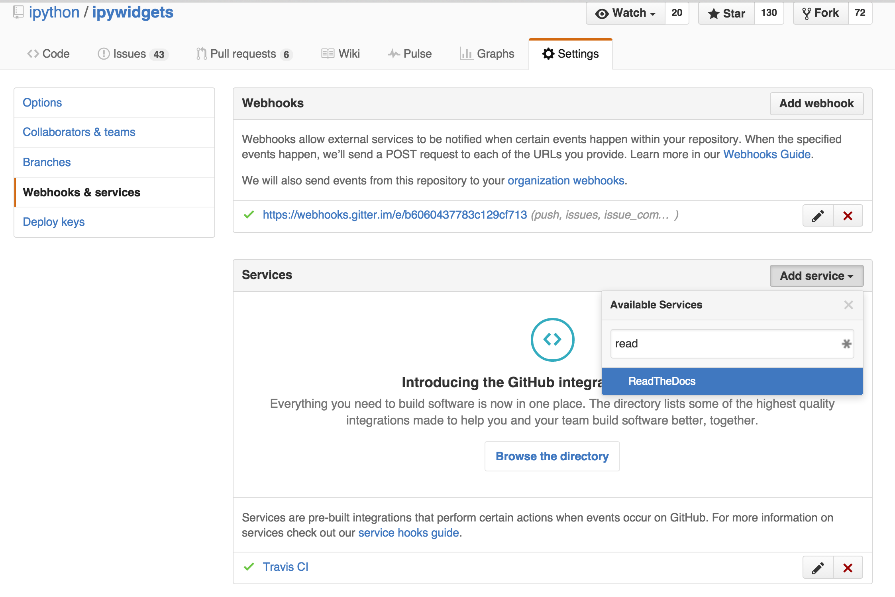
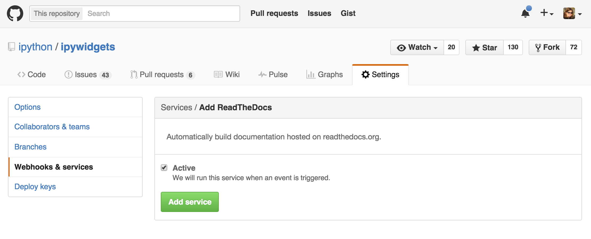
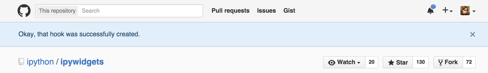

# Building automatically on ReadTheDocs

This explains how to automatically rebuild documentation on ReadtheDocs
every time a pull request is merged into its corresponding GitHub repo.

## Using the ReadTheDocs service

Webhooks and services can be enabled in GitHub repo settings to allow third
party services such as ReadTheDocs. The ReadTheDocs service rebuilds the
project documentation whenever a pull request is merged into the GitHub repo.

### Navigate to Settings

Each GitHub repo has a Settings tab at the far right of the repo menubar. Navigate to Settings and then the **Webhooks & services** submenu tab.

### Add the ReadTheDocs service

Select **Add service** and enter *ReadTheDocs* in the **Available Services** input box.

The Services/Add ReadTheDocs window will open. Press the green **Add service** button to activate the ReadTheDocs service.

### Success

The ReadTheDocs service is added successfully. The service will take effect on the next merged pull request to the project repo.

*Created: 01-07-2016*
