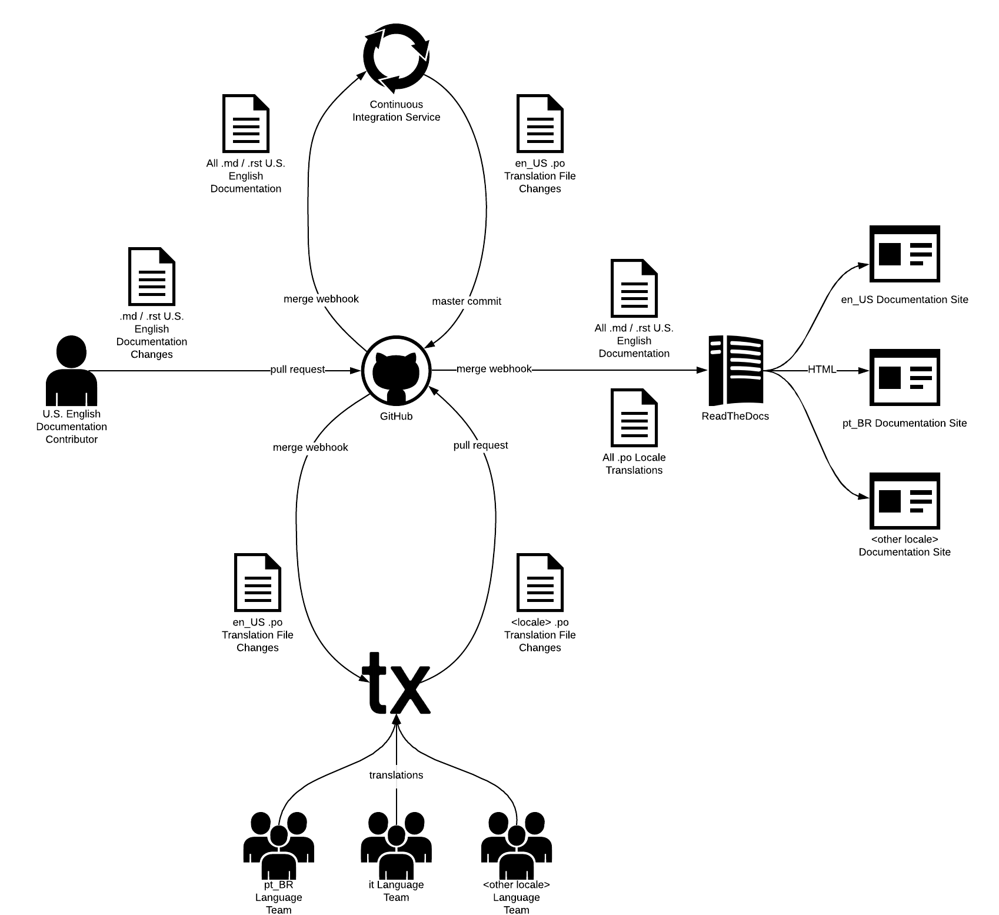
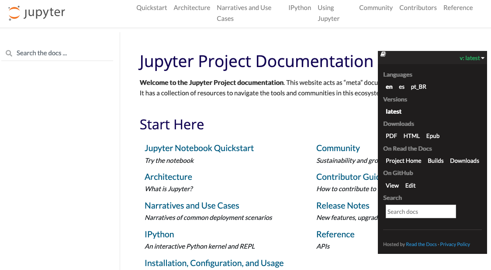

# Supporting translations of documentation

We support and encourage the translation of Jupyter documentation to other languages as one way of
making our community more inclusive and diverse. We are working toward having a consistent model for
translation of [Sphinx](https://www.sphinx-doc.org/) documentation across Jupyter projects based on
prior work in the [Python](https://python.org) and [Django](https://www.djangoproject.com/)
communities. This project (https://jupyter.readthedocs.io) and the
[Jupyter Docker Stacks project](https://jupyter-docker-stacks.readthedocs.io/) are early adopters,
meant to prove out the workflows described on this page.

## Overview

After initial project setup, changes to Sphinx documentation and its translations follow a
continuous integration (CI) and continuous deployment (CD), much like project source code.

## Who is involved in translating documentation

Anyone is welcome to participate in writing and translating Jupyter documentation by participating
in the workflow described below. This workflow has a handful of actors and components:

- A person who makes changes to the English project documentation
- A person who translates snippets of text in the English documentations into another language
  (locale)
- [Portable object files (`.po`)](https://en.wikipedia.org/wiki/Gettext) for the source
  documentation language (e.g., U.S. English, `en-US`) and for other locales (e.g., Brazilian
  Portuguese, `pt-BR`; Moroccan Arabic, `ar-MA`)
- A continuous integration system like TravisCI, CircleCI, or GitHub Actions, responsible for
- [ReadTheDocs](https:/readthedocs.org), our preferred service for building and hosting
  documentation
- [Transifex](https://transifex.com), a localization platform with free plans for open source
  projects, a friendly web interface, and support for `.po` files

### The translation process



<!---Alt text is intentionally left blank because the image content is described thoroughly in the surrounding text.--->

1. A user creates or edits reStructuredText (`.rst`) or Markdown (`.md`) documents written in U.S.
   English.
2. The user submits a pull request on GitHub.
3. A project maintainer reviews and merges the pull request.
4. ReadTheDocs runs Sphinx to convert U.S. English source documents into HTML (e.g.,
   https://jupyter.readthedocs.io/en/latest/architecture/how_jupyter_ipython_work.html)
5. Meanwhile, the CI service runs Sphinx commands to extract translatable _messages_ from U.S.
   English documents into `en-US` portable object (`.po`) files. For example:

```
# 5164fcd91a8a4700ac734562245773ad
#: ../../source/architecture/how_jupyter_ipython_work.rst:13
#: f68a21b0bc884dad9021c276e6490e6d
msgid ""
"The IPython kernel that provides computation and communication with the "
"frontend interfaces, like the notebook"
msgstr ""
```

6. The CI service commits the English `.po` files to the project on GitHub. (e.g.,
   https://github.com/jupyter/jupyter/commit/1330bc409842d8b8a7bbb3a1c63259c34a543be0)
7. Transifex makes the messages in the English `.po` files available for translation in all
   configured languages.
8. Over time, translation teams use the Transifex web application to create, review, and update
   translations for those languages (e.g.,
   https://docs.transifex.com/translation/translating-with-the-web-editor)
9. Transifex submits a pull request to the GitHub project containing a localized `.po` file when all
   of the English messages have been translated, and optionally reviewed, for a given language
   (e.g., https://github.com/jupyter/jupyter/pull/485). For example:

```
# 5164fcd91a8a4700ac734562245773ad
#: ../../source/architecture/how_jupyter_ipython_work.rst:13
msgid ""
"The IPython kernel that provides computation and communication with the "
"frontend interfaces, like the notebook"
msgstr ""
"The IPython kernel que fornece o cálculo e  a comunicação com as interfaces "
"de frontend como o notebook"
```

10. A project maintainer reviews and merges the pull request.
11. ReadTheDocs once again runs Sphinx to convert U.S. English source documents into HTML.
12. ReadTheDocs also runs Sphinx to load localized `.po` files, substitute translations into the
    original English text, and convert those translated documents into HTML (e.g.,
    https://jupyter.readthedocs.io/pt_BR/latest/architecture/how_jupyter_ipython_work.html)

Note: We recognize this flow assumes documentation starts life written in U.S. English. We should
look into removing this assumption in the future if it becomes a significant barrier to new
contributions.

## Community translator workflows

We are delighted when members of the Jupyter community want to help translate documentation. We use
[Transifex](https://transifex.com) to on-board translators in a friendly web interface without
requiring knowledge of git, GitHub, Sphinx, or other software developer tools.

### Creating translations

[Getting Started as a Translator](https://docs.transifex.com/getting-started-1/translators) is an
excellent on-boarding guide for new Transifex users. Follow the instructions to create an account.
When prompted to join a team, look for _jupyter-meta-documentation_ to start contributing
translations to this documentation site. Alternatively, visit
https://www.transifex.com/project-jupyter/jupyter-meta-documentation/ after creating your account
and request to join the project. A project maintainer or language team coordinator will review and
approve your request.

### Reviewing translations

Transifex supports
[Reviewing Translations](https://docs.transifex.com/translation/reviewing-strings), peer review by
members of a language team, to ensure translation quality. Project maintainers can choose whether
Transifex should immediately send a pull request when translations of all text in a document are
available or delay submitting a pull request until after all of those translations are also reviewed
(the
[current setting for this project](https://github.com/jupyter/jupyter/issues/430#issuecomment-552138547)).

### Coordinating translation teams

Project maintainers can also grant Transfex team members the role of
[language coordinator](https://docs.transifex.com/teams/understanding-user-roles#organization-administrator).
Language coordinators have permission to invite users to language teams, approve or deny join
requests, assign language team roles, and perform other administrative actions for a particular
project language. Empowering trusted members of the community as coordinators can help grow
translation teams without software developer involvement.

## Administrator workflows

The translation CI/CD workflow described above requires configuration in GitHub and in Transifex to
function. Project maintainers can follow the instructions below to enable translations for their
Sphinx documentation.

### Creating a Transifex organization

Transifex organizes translation projects under organizations that mirror organizations and
repositories on GitHub. At present, only the https://github.com/jupyter organization has a
corresponding org on Transifex (https://www.transifex.com/project-jupyter/public/) with the
following
[organization administrators](https://docs.transifex.com/teams/understanding-user-roles#organization-administrator):

- @choldgraf
- @parente
- @willingc

GitHub users with permissions to install applications in a GitHub org can follow these instructions
to create a new Transifex-GitHub organization link (e.g., for https://github.com/jupyterhub,
https://github.com/jupyterlab).

1. Create a new user account at https://transifex.com.
2. Complete the sign-up wizard.
3. Create and name a new organization.
4. Click the organization drop down in the top right of the Transifex dashboard page and select
   _Organization Settings_.
5. Click _Details_ in the left sidebar.
6. Click _inviting administrators_ in the _Management_ section to add additional admins to the
   Transifex org.
7. Click _Manage integrations_ in the left sidebar.
8. Click _Install the Transifex app_ in the GitHub section.
9. Select the GitHub organization to associate with the new Transifex organization.
10. Select the repositories that Transifex will have permission to access.
11. Return to the tab where you clicked _Install the Transifex app_ and click _authorize Transifex_
    in the GitHub section.
12. Choose the GitHub organization you just configured in the popup dialog.

Note that you can revise the GitHub-Transifex integration at any time by visiting
https://github.com/settings/installations.

### Creating a Transifex project

Transifex
[organization administrators](https://docs.transifex.com/teams/understanding-user-roles#organization-administrator)
can follow the instructions below to configure new translation projects for GitHub projects in the
GitHub org corresponding to the one on Transifex.

1. Visit https://www.transifex.com.
2. Sign in with the appropriate admin user account for the organization.
3. Click the organization drop down in the top right of the Transifex dashboard page and select
   _Organization Settings_.
4. Click _Create new project_ in the lower left sidebar.
5. Name the translation project after the project on GitHub.
6. Select _Public_ as the privacy type, indicate that the project is open source, and provide the
   GitHub URL for the repository.
7. Select a file-based project.
8. Create a new team for the project.
9. Select _English (en)_ as the source language.
10. Select known target languages. (You can add these later as well.)
11. Click _Create project_.
12. Click _Settings_ under the project name in the left sidebar.
13. Click the _Maintainers_ tab.
14. Invite additional
    [project maintainers](https://docs.transifex.com/teams/understanding-user-roles#project-maintainers),
    typically software developers who will be responsible for maintaining the continuous integration
    and bootstrapping language teams.

### Configuring languages and teams

Transifex organization admins and project managers can add translation languages to a project.

1. Visit https://www.transifex.com.
2. Sign in with the appropriate admin user account for the organization.
3. Click _Languages_ under the project name in the left sidebar.
4. Click _Edit languages_.
5. Add or remove target translation languages.
6. Click _Apply_.

Organization admins, project maintainers, and
[team managers](https://docs.transifex.com/teams/understanding-user-roles#team-managers) can add
users to translation teams with the roles of language coordinator, reviewer, or translator.

1. Click _Teams_ in the top nav bar.
2. Click the _Invite Collaborators_ button in the top right.
3. Enter the username, email address, or full name of a person to add to the project. Note that the
   autocomplete in this field does not always display a popup for the user you wish to invite.
   Confirm you've entered the correct value and move on.
4. Select [the role](https://docs.transifex.com/teams/understanding-user-roles) to assign to the
   user.
5. If the role applies to a specific team, select the team.
6. If the role applies to a specific language, select the language.
7. Click _Invite more_ to enter additional users or _Send invitation_.

### Configuring Transifex-GitHub integration

After configuring organization and project resources on Transifex, project developers can:

- configure Sphinx to produce `.po` files for the source language and read `.po` files containing
  translations
- configure Transifex to watch for source language `.po` file changes
- configure the project CI service to update source language `.po` files when contributors make
  changes to the source documentation

The instructions in this section assume a git repository already contains Sphinx documentation in
the following directory structure:

```
my-project/
  docs/
    build/              # built sphinx artifacts go here
    source/             # documentation source is in here
      conf.py           # sphinx config file
      index.rst         # root of the documentation
    requirements.txt    # sphinx, sphinx-intl, etc.
```

Project developers can do the following to configure Sphinx to seed source `.po` files and
recognization translation `.po` files.

1. Add `sphinx-intl` to your Sphinx project `requirements.txt` or `environment.yaml` if it does not
   already exist.
2. Run `sphinx-intl create-txconfig` in the `docs/` directory.
3. Add the following to the Sphinx `source/conf.py` file.

```python
# -- Translation -------------------------------------------------------------

gettext_uuid = True
locale_dirs = ["locale/"]
```

3. Run `make gettext` to extract all strings from the English source documentation.
4. Run `sphinx-intl update -l en` to generate the English source `.po` files.
5. Submit, review, and merge a pull request with the changes and generated `.po` files.

After merging the pull request, link to the Transifex project to the GitHub repository.

1. Visit https://www.transifex.com.
2. Click _Settings_ under the project name in the left sidebar.
3. Click the _Integrations_ tab.
4. Click _Link Repository_ in the GitHub section.
5. Select the appropriate GitHub repository and integration branch. Then click _Next_.
6. Copy and paste the following configuration into the dialog, adjusting the commented values as
   appropriate, and then click _Next_.

```yaml
filters:
  - filter_type: dir
    file_format: PO
    source_file_extension: po
    # Change this if you selected a different source language during project setup
    source_language: en
    # The path in the GitHub repository where the source .po files reside
    source_file_dir: "docs/source/locale/en/LC_MESSAGES"
    # The path in the GitHub repository where translation .po files reside
    translation_files_expression: "docs/source/locale/<lang>/LC_MESSAGES"
```

7. Select when Transifex will submit translations a back to the repository. Then click _Save &
   Sync_.
8. Click _Close_.
9. Watch the sync status progress.
10. Click _Resources_ in the left sidebar.
11. Click one of the `.po` files to see translation progress by language.
12. Click one of the languages to see details about translation progress, translate text, and review
    translations. See the [Translator workflows](#translator-workflows) section above for details.

After confirming the initial English `.po` files have reached Transifex, set up continuous
integration to ensure source strings are kept up-to-date in Transifex whenever the English
documentation changes. The steps to accomplish this end vary depending on the CI provider. The
following describes how what to do when using GitHub Actions.

1. Create a new GitHub actions workflow file `.github/workflows/gettext.yml` in the project.
2. Add the following content to the file. Note that `secrets.GITHUB_TOKEN` is a built-in secret, not
   something you need to configure ahead of time.

```yaml
name: Extract Translatable Strings

# Run on all branch pushes
on:
  push:
    paths:
      - "docs/source/**"
      - "!docs/source/locale/**"
      - ".github/workflows/gettext.yml"

jobs:
  gettext:
    runs-on: ubuntu-latest
    steps:
      - name: Checkout Code
        uses: actions/checkout@master
      - name: Set up Python
        uses: actions/setup-python@v2
        with:
          python-version: "3.x"
      - name: Install dependencies
        working-directory: docs
        run: pip install -r requirements.txt
      - name: Extract source strings
        working-directory: docs
        run: |
          make gettext
          sphinx-intl update -l en
      - name: Push to master
        # Only commit changes to master if master just changed
        if: github.ref == 'refs/heads/master'
        uses: mikeal/publish-to-github-action@master
        env:
          GITHUB_TOKEN: ${{ secrets.GITHUB_TOKEN }}
```

3. Submit, review, and merge a pull request containing the workflow YAML.

Once you complete the steps in this section, any changes to the source English documentation on the
master branch are pulled into Transifex for translation. Likewise, any translations completed on
Transifex are submitted as pull requests back to the project on GitHub.

### Hosting translations on ReadTheDocs

ReadTheDocs supports building HTML documentation sites from a single GitHub project and its
translations. Administrators of the source language documentation project on ReadTheDocs can
following these instructions to enable builds for other languages.

1. Visit https://readthedocs.org/dashboard/
2. Note the name of existing ReadTheDocs project containing your source language (e.g., `jupyter`).
3. Click `Import a Project`.
4. Click `Import Manually`.
5. Enter the project name you noted above suffixed with a target language locale (e.g.,
   `jupyter-es`, `jupyter-pt-br`).
6. Enter the GitHub URL of the project.
7. Check _Edit advanced project options_.
8. Click _Next_.
9. Select the name of the target language from the _Language_ drop down (e.g. `es` -> _Spanish_,
   `es-mx` -> _Mexican Spanish_, `pt-br` -> _Brazillian Portuguese_).
10. Click `Finish`.
11. Return to the list of projects at https://readthedocs.org/dashboard/
12. Click the project containing the source language.
13. Click _Admin_.
14. Click _Translations_.
15. Choose the name of the translation project created in step 5 from the _Project_ drop down.
16. Click _Add_.
17. Repeat these steps for all other languages the project supports.

Now, any time you merge a pull request from Transifex containing `.po` translation file updates,
ReadTheDocs will build both the source documentation site as well as sites for all supported
languages. ReadTheDocs will associate the sites with one another and make them accessible via
language links in a popup.



## Reference

https://github.com/parente/helloworld-transifex-rtd is a mini-project configured to support the
entire workflow described in this document.
