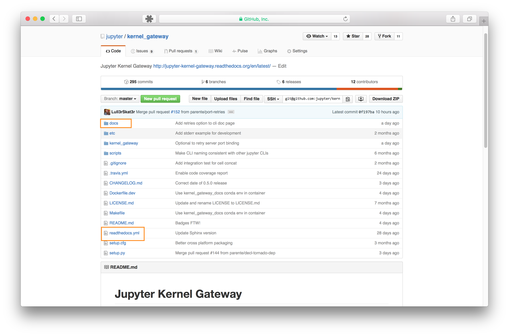

# Structuring a repo for docs

## Root level of the repo

- ``docs`` directory : All source files for documentation go here.
- ``readthedocs.yml`` : configuration file for readthedocs to build using
  conda

## Inside the docs directory

- ``source`` directory : contains all content source files in ``.rst``,
  ``.md``, or ``.ipynb``
- ``makefile`` : used by Sphinx to build the docs
- ``environment.yml`` : conda build instructions

## Sphinx

- ``conf.py`` : Sphinx configuration file
- ``index.rst`` of ``contents.rst`` : Sphinx master table of contents file
- ``_static`` directory : contains images, drawings, icons
- ``_templates`` directory: overrides theme templates and layouts
- ``build`` directory : html files generated by Sphinx (do not check this
  directory into GitHub)