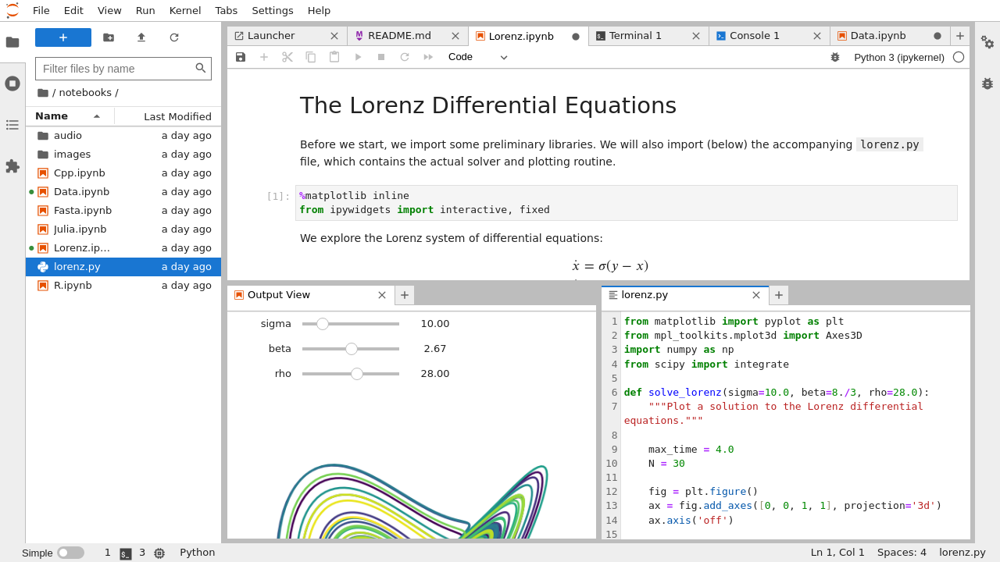

# Project Jupyter Documentation

Welcome to the Project Jupyter documentation site. Jupyter is a large umbrella
project that covers many different software offerings and tools, including the
popular [Jupyter Notebook](https://jupyter-notebook.readthedocs.io/en/latest/)
and [JupyterLab](https://jupyterlab.readthedocs.io/en/latest/) web-based
notebook authoring and editing applications. The Jupyter project and its
subprojects all center around providing tools (and [standards](https://docs.jupyter.org/en/latest/#sub-project-documentation))
for interactive computing with [computational notebooks](#what-is-a-notebook).

## What is a Notebook?

> 📘 **Note:** Read more at [What is Jupyter?](what_is_jupyter)*



**Pictured:** *A computational notebook document, shown inside JupyterLab*

A notebook is a shareable document that combines computer code, plain language
descriptions, data, rich visualizations like 3D models, charts, graphs and
figures, and interactive controls. A notebook, along with an editor (like
JupyterLab), provides a fast interactive environment for prototyping and
explaining code, exploring and visualizing data, and sharing ideas with
others.

## Where do I start?

Most people begin with Jupyter by installing an editing application that fits
their preferences, like [JupyterLab](https://jupyterlab.readthedocs.io/en/latest/)
or [Jupyter Notebook](https://jupyter-notebook.readthedocs.io/en/latest/),
and making their first notebook document:

- Jupyter Notebook offers a simplified, lightweight notebook authoring experience
- JupyterLab offers a feature-rich, tabbed multi-notebook editing environment
  with additional tools like a customizable interface layout and system console
- And more... read about additional notebook interfaces [here](projects/user-interfaces)!

You can also develop your own extensions or applications on top of existing Jupyter
software. Check out the subproject sites below for more information.

## More information

These are a few high-level topics to help you learn more about the Jupyter community and ecosystem.

```{list-table}
:class: front_page_table

* - {doc}`Get started with Jupyter Notebook <start/index>`

      Try the notebook

   - {doc}`Community <community/content-community>`

      Sustainability and growth

* - {doc}`Architecture <projects/architecture/content-architecture>`

      What is Jupyter?

   - {doc}`Contributor Guides <contributing/content-contributor>`

      How to contribute to the projects

* - {doc}`Narratives and Use Cases <use/use-cases/content-user>`

      Narratives of common deployment scenarios

   - {doc}`Release Notes <releases>`

      New features, upgrades, deprecation notes, and bug fixes

* - {doc}`IPython <reference/ipython>`

      An interactive Python kernel and REPL

   - {doc}`Reference <reference/content-reference>`

      APIs

* - {doc}`Installation, Configuration, and Usage <projects/content-projects>`

      Documentation for users

   - {doc}`Advanced <use/advanced/content-advanced>`

      Documentation for advanced use-cases
```

## Sub-project documentation

Individual sub-projects are typically organized around a key feature of the
Jupyter ecosystem, and have their own community, documentation and governance.
Below is a list of documentation for major parts of the Jupyter ecosystem.

```{panels}
User Interfaces
^^^^^^
* [JupyterLab](https://github.com/jupyterlab/jupyterlab)
* [Jupyter Notebook](https://jupyter-notebook.readthedocs.io/en/latest/)
* [nbclassic](https://github.com/jupyterlab/nbclassic)
* [Jupyter Console](https://jupyter-console.readthedocs.io/en/latest)
* [Qt console](https://qtconsole.readthedocs.io/en/stable)
* [Voilà](https://voila.readthedocs.io/)

---
JupyterHub
^^^^^^
* [JupyterHub](https://jupyterhub.readthedocs.io/en/latest)
* [Configurable HTTP proxy](https://github.com/jupyterhub/configurable-http-proxy)
* Authenticators: [LDAP](https://github.com/jupyterhub/ldapauthenticator), [OAuth](https://oauthenticator.readthedocs.io/en/latest/), [Native](https://native-authenticator.readthedocs.io/en/latest/), [LTI](https://ltiauthenticator.readthedocs.io/en/latest/)
* Spawners: [sudo](https://github.com/jupyterhub/sudospawner), [Docker](https://jupyterhub-dockerspawner.readthedocs.io/en/latest/), [Kubernetes](https://jupyterhub-kubespawner.readthedocs.io/en/latest/)
* [Zero to JupyterHub](https://zero-to-jupyterhub.readthedocs.io/en/latest/)
* [All JupyterHub Projects...](https://github.com/jupyterhub)

---
Working with Notebooks
^^^^^^
* [nbclient](https://nbclient.readthedocs.io/en/latest/) - execution
* [nbconvert](https://nbconvert.readthedocs.io/en/latest/) - conversion
* [nbviewer](https://github.com/jupyter/nbviewer/) - viewing
* [nbdime](https://nbdime.readthedocs.io/) - comparing and merging
* [nbgrader](https://nbgrader.readthedocs.io/en/latest/) - grading
* [nbformat](https://nbformat.readthedocs.io/en/latest/) - modification and validation

---
Kernels
^^^^^^
* [IPython](https://ipython.readthedocs.io/en/stable/)
* [IRkernel](https://irkernel.github.io)
* [IJulia](https://github.com/JuliaLang/IJulia.jl)
* [Xeus kernels](https://xeus.readthedocs.io/en/latest/)
* [Community maintained kernels](https://github.com/jupyter/jupyter/wiki/Jupyter-kernels)

---
IPython
^^^^^^
* [IPython](https://ipython.readthedocs.io/en/stable/)
* [ipykernel](https://ipython.readthedocs.io/en/stable/)
* [ipyparallel](https://ipyparallel.readthedocs.io/en/latest/)
* [traitlets](https://traitlets.readthedocs.io/en/stable/)

---
Architecture and Specification
^^^^^^
* [nbformat](https://nbformat.readthedocs.io/en/latest/api.html) - Jupyter Notebook Format
* [jupyter-client](https://jupyter-client.readthedocs.io/en/latest/) - Jupyter Messaging Protocol
* [jupyter-core](https://jupyter-core.readthedocs.io/en/latest/)
* [jupyter-server](https://jupyter-server.readthedocs.io/)
* [jupyterlab-server](https://jupyterlab-server.readthedocs.io/en/stable/)

---
Deployment
^^^^^^
* [Docker Stacks](https://jupyter-docker-stacks.readthedocs.io/en/latest/)
* [Kernel Gateway](https://jupyter-kernel-gateway.readthedocs.io/en/latest/)
* [Enterprise Gateway](https://jupyter-enterprise-gateway.readthedocs.io/en/latest/)

---
Widgets
^^^^^^
* [ipywidgets](https://ipywidgets.readthedocs.io/)
* [widget-cookiecutter](https://github.com/jupyter-widgets/widget-cookiecutter/)
* [All Widget Projects...](https://github.com/jupyter-widgets)

```

## Table of Contents

The rest of the documentation on this site covers major use-cases of the Jupyter ecosystem, as well as topics that will help you navigate the various parts of the Jupyter community.
For more in-depth documentation about a specific tool, we recommend checking out that tool's documentation (see the list above).

(user-docs)=

```{toctree}
:maxdepth: 2

start/index
```

(jupyter-using)=

```{toctree}
:maxdepth: 2

use/using
```

(jupyter-subprojects)=

```{toctree}
:maxdepth: 2

projects/content-projects
```

```{toctree}
:maxdepth: 2

community/content-community
```

(dev-docs)=

```{toctree}
:maxdepth: 2

contributing/content-contributor
```

```{toctree}
:maxdepth: 2

reference/content-reference
```

## Resources

```{csv-table}
:header: Site, Description
:widths: 18, 35

[Jupyter website](https://jupyter.org), Keep up to date on Jupyter
[IPython website](https://ipython.org), Learn more about IPython
[Jupyter Discourse forum](https://discourse.jupyter.org/), Start here for help and support questions
[Jupyter Accessibility](https://jupyter-accessibility.readthedocs.io/), Accessibility sub-project documentation
[Jupyter mailing list](https://groups.google.com/forum/#!forum/jupyter), General discussion of Jupyter's use
[Jupyter in Education group](https://groups.google.com/forum/#!forum/jupyter-education), Discussion of Jupyter's use in education
[NumFocus](https://www.numfocus.org), "Promotes world-class, innovative, open source scientific software"
[Donate to Project Jupyter](https://numfocus.salsalabs.org/donate-to-jupyter/index.html), Please contribute to open science collaboration and sustainability
```


## Indices and tables

- {ref}`genindex`
- {ref}`glossary`
- {ref}`search`
