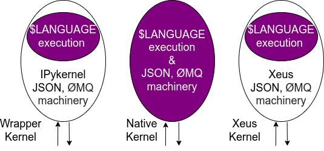
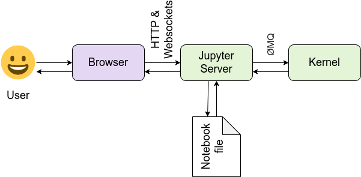

============
Architecture
============

This page has information about the different architectural designs of core
pieces in the Jupyter ecosystem. Some of these are individual projects, and others
show the relationships between projects.

Projects overview
=================

Below is a high level visual overview of project relationships. It is current as of
2022.

.. To edit this file, import it into diagrams.net:  https://app.diagrams.net/
.. image:: /_static/_images/repos_map.png
   :width: 100%
   :alt: Architecture diagram of Jupyter project relationships from servers, applications, API, and kernels.

IPython Kernel
==============

This section focuses on IPython and kernels.
When we discuss ``IPython``, we talk about two fundamental roles:

- Terminal IPython as the familiar REPL
- The IPython kernel, ``IPykernel`` that provides computation and communication with the frontend interfaces, like the notebook

Terminal IPython
----------------

When you type ``ipython``, you get the original IPython interface, running in
the terminal. It does something like this::

    while True:
        code = input(">>> ")
        exec(code)

Of course, it's much more complex, because it has to deal with multi-line
code, tab completion using :mod:`readline`, magic commands, and so on. But the
model is like code example: prompt the user for some code, and when they've
entered it, execute it in the same process. This model is often called a
:term:`REPL`, or Read-Eval-Print-Loop.

The IPython Kernel
------------------

All the other interfaces —- the Notebook, the Qt console, ``ipython console``
in the terminal, and third party interfaces —- use the IPython Kernel. IPykernel
is a separate process which is responsible for running user code, and things
like computing possible completions. Frontends, like the notebook or the Qt
console, communicate with the IPython Kernel using JSON messages sent over
`ZeroMQ <http://zeromq.org/>`_ sockets; the protocol used between the frontends
and the IPython Kernel is described in :ref:`jupyterclient:messaging`.

The core execution machinery for the kernel is shared with terminal IPython.

.. Alt text here and below is intentionally blank
.. this is because the image content is described thoroughly in the surrounding text.

.. image:: figs/ipy_kernel_and_terminal.png
   :alt: 

A kernel process can be connected to more than one frontend simultaneously. In
this case, the different frontends will have access to the same variables.

.. TODO: Diagram illustrating this?

This design was intended to allow easy development of different frontends
based on the same kernel, but it also made it possible to support new
languages in the same frontends, by developing kernels in those languages, and
we are refining IPython to make that more practical.

Today, there are three ways to develop a kernel for another language:
- Wrapper kernels reuse the communications machinery from IPykernel, and implement only the core execution part.
- Native kernels implement execution and communications in the target language.
- Kernels based on `xeus <https://github.com/jupyter-xeus/xeus>`_, a native implementation of the protocol, implement the language-specific part of the kernels. Contrary to the wrapper approach, `xeus` does not depend on a python runtime.

.. To edit this file, import it into diagrams.net:  https://app.diagrams.net/

Wrapper kernels are easier to write quickly for languages that have good
Python wrappers, like `octave_kernel <https://pypi.python.org/pypi/octave_kernel>`_,
or languages where it's impractical to implement the communications machinery,
like `bash_kernel <https://pypi.python.org/pypi/bash_kernel>`_. Native kernels
are likely to be better maintained by the community using them, like
`IJulia <https://github.com/JuliaLang/IJulia.jl>`_ or
`IHaskell <https://github.com/gibiansky/IHaskell>`_. Xeus kernels are easy
to write when the language interpreter provides a C++ or a C API.

.. seealso::

   :ref:`jupyterclient:kernels`

   :ref:`Kernels <kernels-langs>`

The Jupyter Notebook format
===========================

Jupyter Notebooks are structured data that represent your code, metadata, content,
and outputs. When saved to disk, the notebook uses the extension ``.ipynb``, and
uses a JSON structure. For more information about the notebook format structure
and specification, see `the nbformat documentation <https://nbformat.readthedocs.io/en/latest/format_description.html>`_.

The Jupyter Notebook Interface
==============================

Jupyter Notebook and its flexible interface extends the notebook beyond code
to visualization, multimedia, collaboration, and more. In addition to running your code,
it stores code and output, together with markdown notes, in an editable
document called a notebook. When you save it, this is sent from your browser
to the Jupyter server, which saves it on disk as a JSON file with a
``.ipynb`` extension.

.. To edit this file, import it into diagrams.net:  https://app.diagrams.net/

The Jupyter server is a communication hub. The browser, notebook file on disk, and
kernel cannot talk to each other directly. They communicate through the Jupyter server. 
The Jupyter server, not the kernel, is responsible for saving and loading
notebooks, so you can edit notebooks even if you don't have the kernel for
that language—you just won't be able to run code. The kernel doesn't know
anything about the notebook document: it just gets sent cells of code to
execute when the user runs them.

Exporting Jupyter Notebooks to other formats
============================================

The :doc:`Nbconvert tool <nbconvert:index>` in Jupyter converts notebook files to other formats, such
as HTML, LaTeX, or reStructuredText. This conversion goes through a series of
steps:

.. image:: figs/nbconvert.png
   :alt: 

1. Preprocessors modify the notebook in memory. E.g. ExecutePreprocessor runs
   the code in the notebook and updates the output.
2. An exporter converts the notebook to another file format. Most of the
   exporters use templates for this.
3. Postprocessors work on the file produced by exporting.

The `nbviewer <http://nbviewer.jupyter.org/>`_ website uses nbconvert with the
HTML exporter. When you give it a URL, it fetches the notebook from that URL,
converts it to HTML, and serves that HTML to you.

IPython.parallel
----------------

IPython also includes a parallel computing framework,
`IPython.parallel <https://ipyparallel.readthedocs.io/en/latest/>`_. This
allows you to control many individual engines, which are an extended version
of the IPython kernel described above.

JupyterHub and Binder
=====================

JupyterHub is a multi-user Hub that spawns, manages, and proxies multiple instances of the
single-user Jupyter notebook server. This can be used to serve a variety of interfaces
and environments, and can be run on many kinds of infrastructure. JupyterHub on Kubernetes
is a Helm Chart for running JupyterHub on kubernetes infrastructure, and BinderHub is a
customized JupyterHub deployment for shareable, reproducible interactive computing environments.

The links below describe the architecture of JupyterHub and several distributions of
JupyterHub.

* :doc:`JupyterHub core architecture <hub:reference/technical-overview>`
* :doc:`JupyterHub for Kubernetes architecture <z2jh:administrator/architecture>`
* :ref:`BinderHub architecture <bhub:diagram>`

JupyterLab
==========

JupyterLab is a flexible, extensible interface for interactive computing. Below
are a few links that are useful for understanding the JupyterLab architecture.

* :ref:`JupyterLab document model <lab:kernel-backed-documents>`
* :ref:`JupyterLab notebook model <lab:notebook>`
* :doc:`Design patterns in JupyterLab <lab:developer/patterns>`

