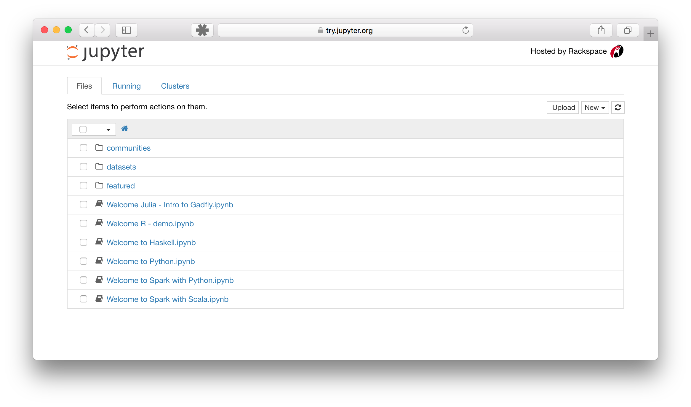

.. _running:

====================
Running the Notebook
====================

After you have installed the Jupyter Notebook on your computer, you are ready
to run the notebook server. You can start the notebook server from the
:term:`command line` (using :term:`Terminal` on Mac/Linux,
:term:`Command Prompt` on Windows) by running::

    jupyter notebook

This will print some information about the notebook server in your terminal,
including the URL of the web application
(by default, ``http://localhost:8888``):

.. code:: bash

    $ jupyter notebook
    [I 08:58:24.417 NotebookApp] Serving notebooks from local directory: /Users/catherine
    [I 08:58:24.417 NotebookApp] 0 active kernels
    [I 08:58:24.417 NotebookApp] The Jupyter Notebook is running at: http://localhost:8888/
    [I 08:58:24.417 NotebookApp] Use Control-C to stop this server and shut down all kernels (twice to skip confirmation).

It will then open your default web browser to this URL.

When the notebook opens in your browser, you will see the :term:`Notebook Dashboard`,
which will show a list of the notebooks, files, and subdirectories in the
directory where the notebook server was started. Most of the time, you will
wish to start a notebook server in the highest level directory containing
notebooks. Often this will be your home directory.

**Notebook Dashboard**

Introducing the Notebook's Command Line Options
-----------------------------------------------

By default, the notebook server starts on port 8888. If port 8888 is
unavailable or in use, the notebook server searches the next available port.
You may also specify a port manually:

.. code:: bash

    jupyter notebook --port 9999

Or start notebook server without opening a web browser:

.. code:: bash

    jupyter notebook --no-browser

The ``--help`` option
~~~~~~~~~~~~~~~~~~~~~
The notebook server provides help messages for other command line arguments
using the ``--help`` flag:

.. code:: bash

    jupyter notebook --help

.. seealso::

   :ref:`Jupyter Installation, Configuration, and Usage <projects/content-projects>`

   Detailed information about command line arguments, configuration, and
   usage.
