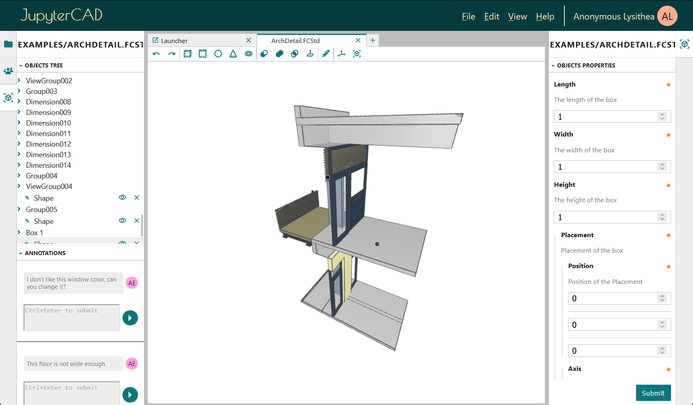
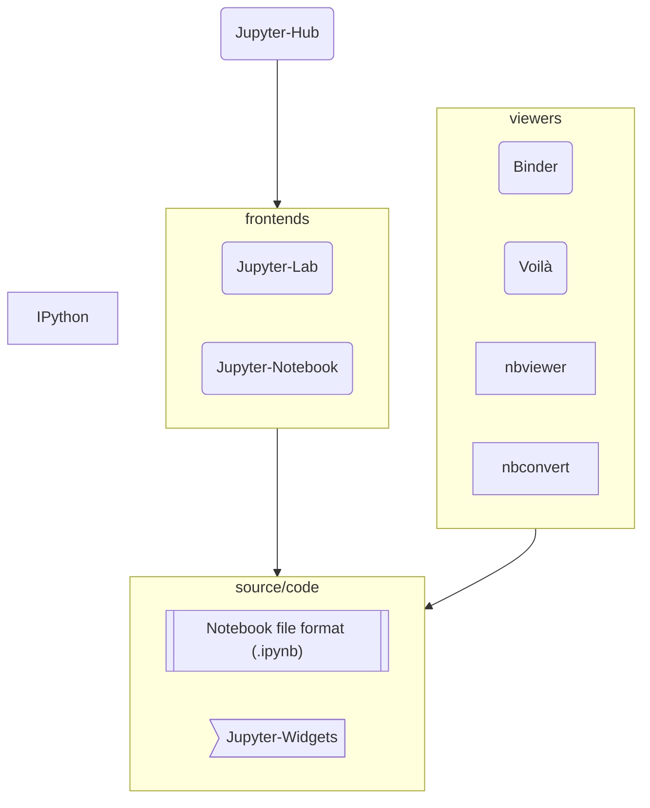

# What is Jupyter?

**Pictured above:** *A notebook inside JupyterLab, showing an interactive*
*view of the insulin receptor.*

> 📘 **About:** This document explains fundamental ideas and software inside the Jupyter ecosystem.

"Jupyter" can mean a lot of things, so let's start from the beginning and
go step-by-step:

Above all, "Project Jupyter" is a large umbrella project that covers
many different software offerings and tools. That includes [Jupyter Notebook](https://jupyter-notebook.readthedocs.io/en/latest/)
and [JupyterLab](https://jupyterlab.readthedocs.io/en/latest/),
which are both popular notebook-editor programs. **The Jupyter project, and**
**its subprojects, all center around providing tools (and standards) for**
**interactive computing with computational notebooks.** If you're not familiar
with some of those things, you can take a guided tour below that explains each
one from the start.

The term "Jupyter" is often used as a shorthand to refer to one of those
products or ideas (which might cause confusion). Let's take a look at each piece,
and provide some clarity, below.

# What is a "Computational Notebook" anyway?

A famous computer programmer ([Donald Knuth](https://en.wikipedia.org/wiki/Donald_Knuth))
popularized the idea to combine explanatory plain english text with computer
code, which is commonly called [literate programming](https://en.wikipedia.org/wiki/Literate_programming).
**By adopting this practice, computer programs, as well as other complex**
**information and ideas, could be better explained to a wide range of people.**

A program written in this way could be printed on paper and shared by hand
as an actual "notebook", but in modern times, they are shared digitally as
"notebook files", and can contain additional rich media like images, 3D models
and interactive figures, along with data and other program outputs.

By opening a notebook with an editor program like [JupyterLab](https://jupyterlab.readthedocs.io/en/latest/),
you can also run the code inside the notebook. Since a notebook can contain
code that does virtually anything, you can do nearly anything regular software
can do inside of a notebook. For example, a notebook file might be used to:

- Read spreadsheets (or create them) to build reports about your household spending
- Show proof of your college thesis with interactive graphs and source data
- [Process astronomical data](https://jwst-docs.stsci.edu/jwst-science-calibration-pipeline/jwst-pipeline-notebooks#gsc.tab=0)
  from the James Webb Space Telescope (JWST)
- Generate an [image of a black hole](https://numfocus.org/case-studies/first-photograph-black-hole)
  by processing telescope data
- Calculate the presence of [gravitational waves]((https://blog.jupyter.org/congratulations-to-the-ligo-and-virgo-collaborations-from-project-jupyter-5923247be019))
  from observatory data

Those last three are real world examples that demonstrate the scientific
community's usage of computational notebooks. Because scientists,
engineers, and other technical people so often need to perform and communicate
sophisticated calculations to describe their work, these "computational
notebooks" became a very popular way to share their work and ideas.

Notebooks are not just for NASA scientists either: Students, hobbyists, and
business people commonly use the fast, interactive workflows in JupyterLab to
make notebooks that help solve everyday problems. You can use them to explain
your own ideas to others, to learn, to automate tasks at home or at work,
visualize complex information, and more.

When someone uses the term "notebook", they might be referring to:

- A notebook file on their computer
- The idea of combining computer code, explanatory text, images and more into
  the "notebook format"
- The "Jupyter Notebook" application, used to author and edit digital notebook
  files
- Jupyter's ``.ipynb`` notebook file format (used to save your notebook files
  on your computer), which is interpreted by the ``nbformat`` software library

And the term "Jupyter" might refer to:

- "Project Jupyter", the overarching umbrella project
- The "Jupyter Notebook" or "JupyterLab" editing programs (or other Jupyter
  products)

The name Jupyter comes from the three programming languages the project
originally supported: Julia (ju), Python (pyt) and R (r).

# How do the Jupyter notebook-editor programs work?

It is common for notebook-editor programs like JupyterLab, or Jupyter
Notebook, to share some features and workflows, because they are influenced
by a common set of ideas about computational notebooks, their advantages,
and how best to work with them effectively.

Let's take a look at some of those ideas.

## Interactive programming (the REPL)

In the past, writing programs, running them, and seeing results was commonly
a slower and more deliberative process than it is today.

As time passed, new techniques were discovered that sped up the process
between writing code, running it, and seeing results. Languages like [Python](https://en.wikipedia.org/wiki/Python_(programming_language))
were also later introduced that offered some unique advantages over
older languages.

For instance, Python is an interpreted language, so it does not need to be [compiled](https://en.wikipedia.org/wiki/Compiler)
before it can be run (saving programmers steps and time). It is also a
dynamically-typed language that does not require the programmer to specify
the type of their data ahead of time before using it, which can sometimes
save time and reduce the complexity of code (particularly for smaller,
simpler programs).

Another programming technique (which is key to the Jupyter notebook-editing
programs) is the Read-Eval-Print-Loop ([REPL](https://en.wikipedia.org/wiki/Read%E2%80%93eval%E2%80%93print_loop)),
which allows a programmer to interactively write code, run it, keep their
data and variables intact, then rewrite, re-run, and refine their code
on-the-fly (without losing data after the program finishes running).

A REPL is so named because the programmer writes snippets of code that are
first read (R), then Evaluated (E) or in other words executed, the results
are printed (P) to some kind of display or output, and that process happens
repeatedly in a loop (L), where the REPL waits until the programmer has
another snippet of code to execute.

New snippets of code can refer to variables defined in previous Eval steps,
because the REPL keeps objects that were created (by previous runs of the
loop) in-memory, until the user closes their REPL.

## Kernels

Notebook editor programs like JupyterLab create a REPL (read more about those
above) for each of your open notebook files, in a language of your choice. In
the Jupyter ecosystem, each of these REPL's is called a kernel, and it holds
the data and objects you create with your notebook code in a long-running
program on your computer (the management and creation of these kernels
is orchestrated by the [Jupyter Server](https://jupyter-server.readthedocs.io/en/latest/#who-s-this-for),
more on that later).

This is why you don't lose your data and variables when you execute multiple
notebook cells in a row, they stay alive inside the REPL so that you can
continue to use them to explore the data and problem you are investigating
(though if you shut down the Jupyter server that holds the kernels, you will
lose those variables).

The kernels that run in the background for each of your notebooks are what
power the fast, exploratory programming workflows that Jupyter notebook
editor programs excel at.

## Multiple programs, one experience (client-server architecture)

Most Notebook editor programs in Project Jupyter, like JupyterLab, may seem like
a single experience, but when you run JupyterLab on your laptop, there are
actually several programs running independently that all coordinate with
each other to offer you the notebook editing experience you may already be
familiar with.

This might seem like an unnecessary background detail, but some clarity on
the inner workings can help demystify your notebook authoring experience, and
open up new features, ideas and workflows that you can take advantage of.

A many-pieces (modular) approach also has advantages for people using Jupyter
software, and to the people who write it.

Let's look at some of the pieces:

- JupyterLab's interface is a web app that you open in a browser program
  like FireFox or Google Chrome (websites themselves commonly have code
  that defines their behavior, and JupyterLab's interface is no exception).

- [Jupyter Server](https://jupyter-server.readthedocs.io/en/latest/#who-s-this-for)
  runs in the background, and it orchestrates the creation, management of, and
  communication with, your notebook kernels while you're running your notebooks.

- Jupyter kernels themselves are independent programs (operating system
  processes), and each one is its own REPL in whatever language you
  requested (commonly Python, though hundreds of other languages and
  kernels are [also available](https://docs.jupyter.org/en/latest/projects/kernels.html)).

With this design, any program (that you enable) can talk to your kernels
using common internet communication technologies like HTTP. This gives
you the power to edit, view, share, and manipulate your data across many
different programs. One kernel can even connect to multiple editing programs
simultaneously! (Similarly, in JupyterLab, you can connect a notebook and a
console to the same kernel!)

Project Jupyter actually defines a [standard](https://jupyter-protocol.readthedocs.io/en/latest/messaging.html)
that other programs can follow that will allow them to hook into your
kernels in virtually any way you can imagine. You can invent new editing
and viewing experiences for your data this way, using the interactive
computing capabilities provided by the kernels.

## Benefits of a many-piece design

By breaking up a program like JupyterLab into multiple component pieces, you
can customize the software to meet your needs. If one piece is missing something,
you can replace it with a custom version made by yourself or another person to
add whatever features you would like to see.

You can also invent completely new experiences using those pieces that the
designers may not have imagined when they started, and they can often inter-
operate seamlessly with existing Jupyter software.

Because Jupyter Server provides kernel communication and management features
in a cohesive, self-contained package, for instance, new notebook editor
programs can focus solely on adding new interface and editing experiences,
leaving the task of creating and managing new kernels completely up to the
Jupyter Server.

[JupyterCAD](https://jupytercad.readthedocs.io/en/latest/) is a 3D modeling
tool built on top of Jupyter software, for instance, and there are
[other examples too](https://github.com/glue-viz/glue-jupyter).

**Pictured above:** *The JupyterCAD program.*

## Talking to Kernels (The Jupyter Protocol)

Anyone can make new software that talks to Jupyter's kernels (read more
about those above), by using the [Jupyter Protocol](https://jupyter-client.readthedocs.io/en/latest/messaging.html).
The protocol provides a standardized blueprint for passing information
back and forth between the kernels and other software.

By implementing the designs described in the Jupyter Protocol, you could
invent a completely new interactive programming experience, or add support
for a new programming language to Jupyter.

Because Project Jupyter is free and open, it encourages anyone to explore
new ways of working with their notebooks and kernels, and likes to offer
compatibility and interoperation with other software.

# What else should I know about Project Jupyter?

Jupyter software is free and open-source, developed by a global community
of volunteers and contributors, available for the benefit of all.

Project Jupyter welcomes people from all backgrounds and with many types
of skills (not just software!) so we encourage you to join us! You can
share feedback about your experiences directly with the people who make
Jupyter software, or volunteer and contribute to help Jupyter in many
different ways, like:

- Testing newly released versions
- Writing tutorials
- Adding software features
- Hosting the [weekly video meetings](https://jupyter.org/community#live-events)
- Helping others in the community
- ...and more!

The project is split into largely independent subprojects which handle
different aspects of Jupyter software and the community. A central council,
the [Jupyter Executive Council](https://jupyter.org/governance/executive_council.html),
makes decisions about project-wide goals and policies, while different
subprojects handle the actual development of the various software components.

Some subprojects take care of broader topics, such as the [Accessibility](https://jupyter-accessibility.readthedocs.io/en/latest/),
[Security](https://jupyter.org/security), [Community](https://docs.jupyter.org/en/latest/community/content-community.html), and [Documentation](https://github.com/jupyter/docs-team-compass) projects.

# A (Partial) Tour of the Jupyter Universe

In the following sections, we are going to look at some popular components of
the Jupyter ecosystem. This is *not* a comprehensive reference of every aspect
of Jupyter, but rather a big-picture summary that should help illustrate some
important parts that were discussed earlier.

If you are completely new to *Jupyter*, the project's [About](https://docs.jupyter.org/en/latest/#sub-project-documentation)
page is good reading that will introduce you to many of the different subprojects.

If you want to know more about the organizational structure, check out the
[Governance](https://jupyter.org/governance/overview.html) pages.

And if you would like to contribute to the project, have a look at the
[Get Involved](https://jupyter.org/community#join-the-jupyter-community) page.

The graph below presents the best known software components of the Project.

Connections and groups in this diagram are not formal relationships, but
simple indicators to help us draw the big picture in the next sections.

### Notebook Editor Programs

- The [JupyterLab](https://jupyterlab.readthedocs.io/en/latest/) notebook editor
- [Jupyter Notebook](https://jupyter-notebook.readthedocs.io/en/stable/) notebook editor

Two popular notebook-editor programs made by Project Jupyter are Jupyter-Notebook and
JupyterLab, though there are others. Which one you choose to use is
mostly a matter of preference (both Notebook and Lab provide many of the
same capabilities for editing and running notebooks):

- Jupyter Notebook offers a simplified, lightweight notebook authoring
  experience

- JupyterLab offers a more customizable, feature-rich, tabbed multi-notebook
  editing environment, and has additional tools like a customizable layout
  and system console (a common tool used by programmers)

- And more!

A professor, for instance, might use JupyterLab for their daily work as a data
analyst, and Jupyter Notebook while teaching to provide a simpler, more focused
view of the notebook's content to their students.

### ipython

- [The IPython REPL](https://ipython.readthedocs.io/en/stable/index.html)

A long time ago, a precursor to Jupyter was created, called `ipython` (see
the [History of Jupyter](LINK) to learn more about that). It provides advanced
REPL features that are still used today in Jupyter software, as it is the default
Python kernel bundled with JupyterLab and Jupyter Notebook.

`ipython` makes some additional commands available that you can type directly
alongside your Python code in your notebook cells. Read more about some of
these features below:

- [Interactive shell](https://ipython.readthedocs.io/en/stable/interactive/tutorial.html)
- [Magic commands](https://ipython.readthedocs.io/en/stable/interactive/magics.html)

For more details on IPython features check [`docs.jupyter.org > Projects > IPython`](https://docs.jupyter.org/en/latest/projects/ipython_projects.html).

### The notebook format

- [The nbformat software library](https://nbformat.readthedocs.io)

Jupyter uses the `.ipynb` file format to store notebook files on your computer
(where the data and outputs of your notebook reside for long term storage).
The .ipynb format is interpreted and modified by the nbformat software library.

The `.ipynb` format is a type of json document, which holds your notebook cells,
program outputs, and metadata inside a structured text file.

### JupyterHub

- [JupyterHub for multi-user setups](https://jupyterhub.readthedocs.io)

JupyterHub provides a multi-user management system where many different people
can log in and use their own isolated notebook editor program and environment.

With JupyterHub, editing and running notebook files is still performed by an
editor program like Lab or Notebook. The Hub is responsible for authenticating
users and providing them their corresponding Lab/Notebook instance connection.

JupyterHub can be set up in different system configurations:

- In a single computer
- In a cluster of computers
- In containers in the cloud

JupyterHub is quite flexible for many different multi-user scenarios.

### Interactive Buttons, Sliders and more with ipywidgets

- [Jupyter Widgets (AKA ipywidgets)](https://ipywidgets.readthedocs.io/en/latest/)

Jupyter Widgets (also called ipywidgets) provides interactive interface
elements that you can add directly into your notebooks.

- Note: The subproject and high-level references to the widgets were renamed to
Jupyter-Widgets, but Jupyter-Widgets and IPyWidgets are the very same thing. To
not break compatibility with older code, the software library is still called
`ipywidgets`.
